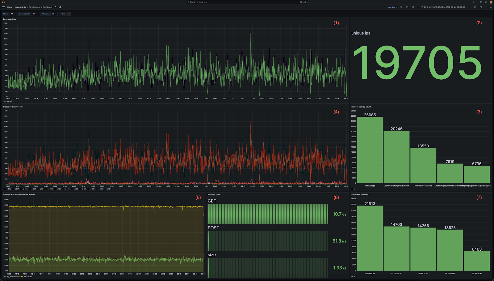
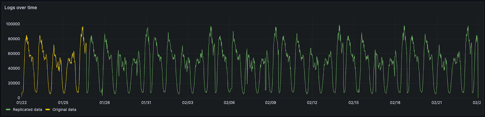
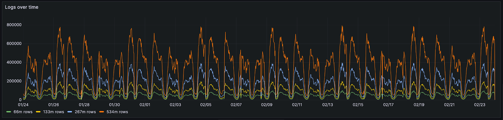

# Simple Logging Benchmark for ClickHouse

The files in this folder represent a very simple logging benchmark for ClickHouse. This is not intended to be an exhaustive benchmark is only intended to provide an example of the compression rates and query performance that can be achieved when using ClickHouse for log data.

This repository supports the blog [Cost-predictable logging at scale with ClickHouse, Grafana & WarpStream](https://clickhouse.com/blog/cost-predictable-logging-with-clickhouse-vs-datadog-elastic-stack).

## Environment

This benchmark was originally performed against a [ClickHouse Cloud Development tier service](https://clickhouse.com/pricing). This can be started for less than $200 per month. 

While the results [here](./results) assume the use of a service of this size, this test should be valid against any ClickHouse self-managed installation or Cloud instance. Results will vary in these cases and users may wish to test with [more or less data](#duplicating-data), depending on the specification.

### Requirements

This benchmark relies on the ClickHouse Client being installed locally. Instructions [here](https://clickhouse.com/docs/en/install).

## Scenario

The benchmark aims to replicate the queries from of a typical Grafana dashboard that could potentially be used be an SRE to perform issue diagnostics. This dashboard consists of the following 7 visualizations:

1. A line chart showing logs over time
1. A metric showing the total IPs inbound IP addresses
1. A bar chart showing the top 5 website paths accessed
1. Status codes over time as a multi-line chart
1. Average and 99th response time over time as a multi-line chart
1. Data transferred by each HTTP request type as a bar gauge
1. Bar chart of top IP addresses by count as a bar chart



This dashboard is subjected to a series of user drill-downs, replicating a user diagnosing a specific issue. We capture the resulting queries and use these for our benchmark below.  The sequence of actions are shown below. All filters are accumulative, thus replicating a user drilling down:

1. Open the dashboard to the most recent 6 hours. Queries [here](./queries/1-time.txt).
1. Looking for errors by drilling down on 404 status code i.e. `status=404`. Queries [here](./queries/2-time+status.txt).
1. Isolating the errors by adding an additional filter for a `request_path`. Queries [here](./queries/3-time+status+request_path.txt).
1. Isolating an impacted an user by filtering to a specific IP using the `remote_addr` column. Queries [here](./queries/4-time+status+request_path+remote_addr.txt).
1. Evaluating SLA breaches by logging for accesses with a response time over 4 secs.  Queries [here](./queries/5-time+status+request_path+remote_addr+runtime.txt).
1. Zoom out for a full month to identify patterns over time. Queries [here](./queries/6-status+request_path+remote_addr+runtime.txt).

While these behaviors are artificial with no specific event identified, they aim to replicate typical usage patterns of a centralized logging solution by an SRE. 

The full queries for each step can be found [here](./queries/). Each file represents the queries issued at each step and contains the queries for the whole dashboard.

## Limitations

This benchmark only measures query latency. Each query is executed sequentially. Parallel execution of queries does not occur.

In reality, Grafana issues multiple queries at once. Given ClickHouse is comfortable with many queries per second (1000 per replica in ClickHouse Cloud), we do not expect this to measurably impact query response time but acknowledge it as a limitation of this test. The benchmark also makes no effort to test ClickHouse under high concurrency loads, with many users opening dashboards and querying. 

## Dataset

This benchmark uses a publicly available [Web Server Access Log dataset](https://www.kaggle.com/datasets/eliasdabbas/web-server-access-logs/). While the schema of this dataset is simple, it is equivalent to commonly held nginx and apache logs. An example is shown below:

```bash
54.36.149.41 - - [22/Jan/2019:03:56:14 +0330] "GET /filter/27|13%20%D9%85%DA%AF%D8%A7%D9%BE%DB%8C%DA%A9%D8%B3%D9%84,27|%DA%A9%D9%85%D8%AA%D8%B1%20%D8%A7%D8%B2%205%20%D9%85%DA%AF%D8%A7%D9%BE%DB%8C%DA%A9%D8%B3%D9%84,p53 HTTP/1.1" 200 30577 "-" "Mozilla/5.0 (compatible; AhrefsBot/6.1; +http://ahrefs.com/robot/)" "-"
31.56.96.51 - - [22/Jan/2019:03:56:16 +0330] "GET /image/60844/productModel/200x200 HTTP/1.1" 200 5667 "https://www.zanbil.ir/m/filter/b113" "Mozilla/5.0 (Linux; Android 6.0; ALE-L21 Build/HuaweiALE-L21) AppleWebKit/537.36 (KHTML, like Gecko) Chrome/66.0.3359.158 Mobile Safari/537.36" "-"
31.56.96.51 - - [22/Jan/2019:03:56:16 +0330] "GET /image/61474/productModel/200x200 HTTP/1.1" 200 5379 "https://www.zanbil.ir/m/filter/b113" "Mozilla/5.0 (Linux; Android 6.0; ALE-L21 Build/HuaweiALE-L21) AppleWebKit/537.36 (KHTML, like Gecko) Chrome/66.0.3359.158 Mobile Safari/537.36" "-"
```

This 3.5GiB dataset contains around 10m log lines and covers 4 days in 2019. More importantly, the cardinality of the columns and cyclic patterns of the data are representative of real data. Utilizing a [publicly available](https://github.com/db-benchmarks/db-benchmarks/blob/main/tests/logs10m/prepare_csv/converter.php) script we have converted this dataset to CSV* to simplify insertion. The size of the respective files remains comparable. 

An example CSV entry is shown below:

```bash
"time_local","remote_addr","remote_user","runtime","request_type","request_path","request_protocol","status","size","referer","user_agent"
"2019-02-01 09:43:29","54.36.149.47","-",2634,"GET","/filter/p12590,v1|چند رنگ ,v1|نقره ای مشکی","HTTP/1.1",200,33575,"-","Mozilla/5.0 (compatible; AhrefsBot/6.1; +http://ahrefs.com/robot/)"
"2019-02-01 09:43:29","130.185.74.243","-",8686,"GET","/filter/stexists,p3,t13,t11,t10,b36","HTTP/1.1",200,32847,"-","Mozilla/5.0 (Windows NT 6.1; rv:42.0) Gecko/20100101 Firefox/42.0"
"2019-02-01 09:43:29","54.36.148.196","-",2909,"GET","/filter/b105,b126,b180,p46","HTTP/1.1",200,35673,"-","Mozilla/5.0 (compatible; AhrefsBot/6.1; +http://ahrefs.com/robot/)"
```

We have replicated this data to cover a 30 day period. While this duplicates the cyclic pattern of the data, this is considered sufficient for this benchmark and akin to typical weekly periodicity.



This month's data consists of 66 million rows and 20GiB of raw CSV/log data. 

### Duplicating data

In order to replicate this data for larger tests, and preserve its data properties, we use a simple technique. Rather than simply duplicate data, we merge the existing data with a copy whose order has been randomized. This involves a [simple script](./duplicate_data.py) which iterates through the both authoritative and randomized file line by line. Lines from the randomized file and authoritative file are in turn copied into a target file. Both “paired lines” are assigned the date from the authoritative file. This ensures the cyclic pattern shown above is preserved. This is in contrast to simply duplicating lines which would cause duplicate lines to be placed next to each other. This would benefit compression and provide an unfair comparison - worsening as we duplicated the data. Below we show the same data duplicated using the above technique for 133 million, 534 million and a billion log lines.



```bash
usage: duplicate_data.py [-h] [--duplication_factor DUPLICATION_FACTOR] source blend_file target

Duplicate the contents of a source file to a target file.

positional arguments:
  source                Path to the source file
  blend_file            Path to the blend_file file
  target                Path to the target file

options:
  -h, --help            show this help message and exit
  --duplication_factor DUPLICATION_FACTOR
                        Duplication factor
```

A duplication factor of `2` would double the size of the file.

Users can run this script if interested. Alternatively example datasets of various size are provided for download below. 

### Public datasets

Sample datasets of various sizes are available in CSV format (rows, uncompressed size, compressed size) covering the period of 30 days:

- [66m,19GB,1.9GB](https://datasets-documentation.s3.eu-west-3.amazonaws.com/http_logs/data-66.csv.gz)
- [133m,38GB,4.2GB](https://datasets-documentation.s3.eu-west-3.amazonaws.com/http_logs/data-133.csv.gz)
- [267m,76GB,8.2GB](https://datasets-documentation.s3.eu-west-3.amazonaws.com/http_logs/data-267.csv.gz)
- [534m,152GB,16.1GB](https://datasets-documentation.s3.eu-west-3.amazonaws.com/http_logs/data-534.csv.gz)
- [1064m,304GB,31.6GB](https://datasets-documentation.s3.eu-west-3.amazonaws.com/http_logs/data-1064.csv.gz)
- [5340m,1.48TiB,260.7GB](https://datasets-documentation.s3.eu-west-3.amazonaws.com/http_logs/data-5280.csv.gz)

An ordered sample dataset can be downloaded [here](https://datasets-documentation.s3.eu-west-3.amazonaws.com/http_logs/logs-534.csv.gz) containing 534m rows.

## Schema

The following schema is used for ClickHouse. 

```sql
CREATE TABLE logs
(
  `remote_addr` String,
  `remote_user` String,
  `runtime` UInt64,
  `time_local` DateTime,
  `request_type` String,
  `request_path` String,
  `request_protocol` String,
  `status` UInt64,
  `size` UInt64,
  `referer` String,
  `user_agent` String
)
ENGINE = MergeTree
ORDER BY (toStartOfHour(time_local), status, request_path, remote_addr)
```

This represents a naive unoptimized schema. Further optimizations are possible which improve compression rates by [5% in our tests](./results/compression.md). However, the above represents a getting started experience for a new user. We therefore test with the least favorable configuration. Alternative schemas can be found [here](./results/compression.md) showing the changes in compression.

## Loading data

Users can load data using a simple `INSERT INTO SELECT` from the `clickhouse-client` as shown below.

```bash
wget https://datasets-documentation.s3.eu-west-3.amazonaws.com/http_logs/data-66.csv.gz

INSERT INTO logs FROM INFILE 'data-66.csv.gz' FORMAT CSVWithNames
```

## Compression

Compression can be evaluated with the following query:

```sql
SELECT
	table,
	formatReadableQuantity(sum(rows)) AS total_rows,
	formatReadableSize(sum(data_compressed_bytes)) AS compressed_size,
	formatReadableSize(sum(data_uncompressed_bytes)) AS uncompressed_size,
	round(sum(data_uncompressed_bytes) / sum(data_compressed_bytes), 2) AS ratio
FROM system.parts
WHERE (table LIKE 'logs%') AND active
GROUP BY table
ORDER BY sum(rows) ASC
```

## Running tests

To run tests the script [`run_queries.sh`](./run_queries.sh) is provided.

This executes the queries in each file [here](./queries/). Each file represents a step in our drill down scenario and contains the queries for the dashboard with the appropriate filters. Files are numbered so as to ensure they execute in order. Queries within files are executed sequentially. See [Limitations](#limitations).

The script requires the environment variables `CLICKHOUSE_HOST`, `CLICKHOUSE_USER` and `CLICKHOUSE_PASSWORD` to set as shown below.

```bash
export CLICKHOUSE_HOST=pv0bmfecql.europe-west4.gcp.clickhouse.cloud
export CLICKHOUSE_USER=default
export CLICKHOUSE_PASSWORD='password'

./run_queries.sh
```


As shown, the script runs every query 3x. This can be used to determine a hot, cold and average performance.

## Results


[Query results](./results/query_performance.md)

[Compression results](./results/compression.md)

[Parallel Replica results](./results/parallel_replicas.md)
