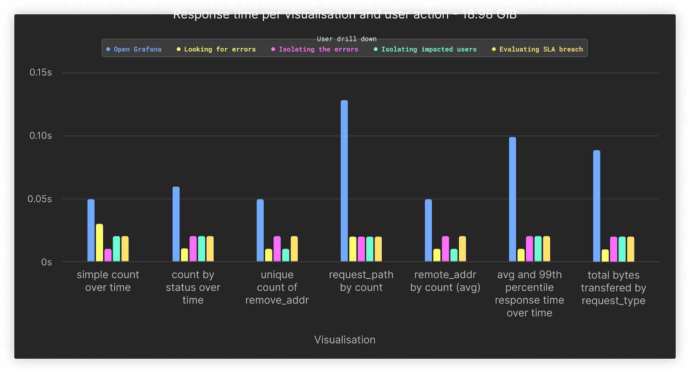
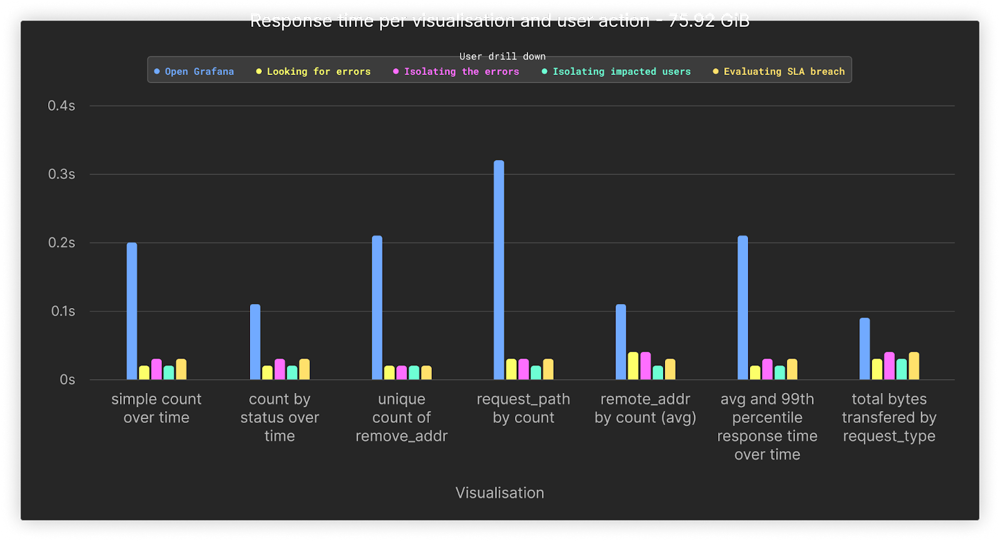
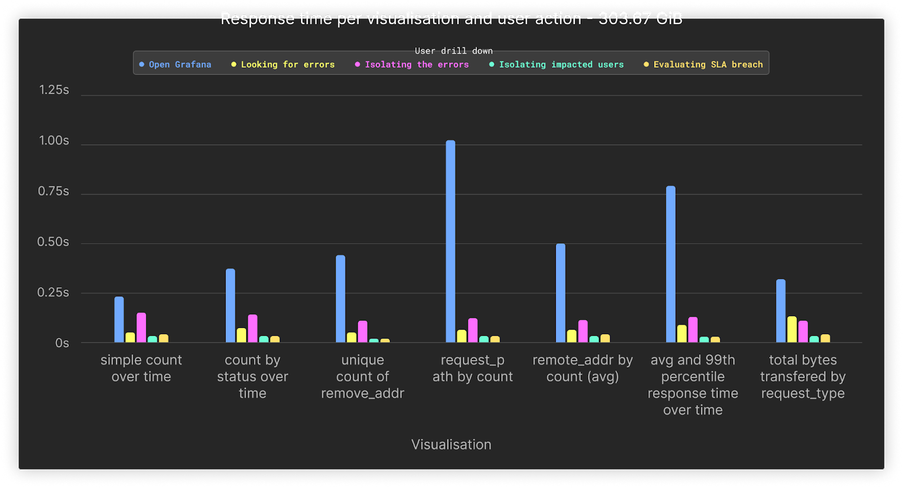
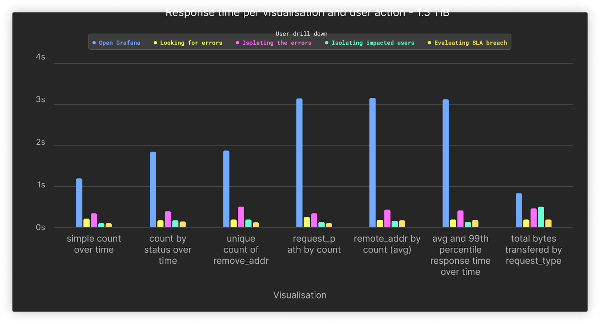

# Query Performance

The following captures the query performance at different volumes.

All results assume the use of a ClickHouse Cloud Development tier service.

Each column cell contains 3 comma-separated values, representing the query running three times to identify hot and cold performance.

## 66 million rows/19 Gib Uncompressed

|            **User Action**             |                       **Filter**                      |   | simple count over time | count by status over time | unique count of remote_addr | request_path by count | remote_addr by count (avg) | average and 99th percentile response time transfered over time | total bytes transfered by request_type |
|:--------------------------------------:|:-----------------------------------------------------:|---|:----------------------:|:-------------------------:|:---------------------------:|:---------------------:|:--------------------------:|:--------------------------------------------------------------:|:--------------------------------------:|
|                                        |                                                       |   |                        |                           |                             |                       |                            |                                                                |                                        |
|              Open Grafana              |                         time                          |   |    0.081,0.013,0.065   |     0.111,0.028,0.030     |      0.102,0.029,0.028      |   0.144,0.084,0.156   |      0.070,0.031,0.036     |                        0.129,0.102,0.076                       |            0.164,0.029,0.083           |
|           Looking for errors           |                     time + status                     |   |    0.016,0.012,0.050   |     0.013,0.012,0.015     |      0.013,0.014,0.013      |   0.027,0.014,0.013   |      0.011,0.013,0.017     |                        0.016,0.014,0.014                       |            0.015,0.012,0.012           |
|          Isolating the errors          |              time + status + request_path             |   |    0.015,0.014,0.015   |     0.018,0.019,0.020     |      0.020,0.017,0.022      |   0.031,0.016,0.021   |      0.020,0.021,0.020     |                        0.020,0.019,0.020                       |            0.018,0.021,0.019           |
|        Isolating impacted users        |       time + status + request_path + remote_addr      |   |    0.018,0.013,0.026   |     0.019,0.016,0.018     |      0.012,0.014,0.014      |   0.015,0.015,0.019   |      0.012,0.017,0.012     |                        0.016,0.015,0.025                       |            0.020,0.015,0.014           |
|         Evaluating SLA breach          | time + status + request_path + remote_addr  + runtime |   |    0.022,0.018,0.024   |     0.034,0.017,0.020     |      0.015,0.017,0.016      |   0.022,0.015,0.015   |      0.016,0.017,0.019     |                        0.019,0.019,0.017                       |            0.023,0.019,0.020           |
| Zoom Out to check for similar patterns |     status + request_path + remote_addr  + runtime    |   |    1.151,0.337,1.291   |     0.329,0.322,0.319     |      0.320,0.390,0.354      |   0.340,0.362,0.324   |      0.477,0.336,0.379     |                        0.320,0.349,0.393                       |            0.414,0.332,0.319           |

**Averages**

|            **User Action**             |                       **Filter**                      |   | simple count over time | count by status over time | unique count of remote_addr | request_path by count | remote_addr by count (avg) | average and 99th percentile response time transfered over time | total bytes transfered by request_type |
|:--------------------------------------:|:-----------------------------------------------------:|---|:----------------------:|:-------------------------:|:---------------------------:|:---------------------:|:--------------------------:|:--------------------------------------------------------------:|:--------------------------------------:|
|                                        |                                                       |   |                        |                           |                             |                       |                            |                                                                |                                        |
|              Open Grafana              |                         time                          |   |          0.05          |            0.06           |             0.05            |          0.13         |            0.05            |                               0.1                              |                  0.09                  |
|           Looking for errors           |                     time + status                     |   |          0.03          |            0.01           |             0.01            |          0.02         |            0.01            |                              0.01                              |                  0.01                  |
|          Isolating the errors          |              time + status + request_path             |   |          0.01          |            0.02           |             0.02            |          0.02         |            0.02            |                              0.02                              |                  0.02                  |
|        Isolating impacted users        |       time + status + request_path + remote_addr      |   |          0.02          |            0.02           |             0.01            |          0.02         |            0.01            |                              0.02                              |                  0.02                  |
|         Evaluating SLA breach          | time + status + request_path + remote_addr  + runtime |   |          0.02          |            0.02           |             0.02            |          0.02         |            0.02            |                              0.02                              |                  0.02                  |
| Zoom Out to check for similar patterns |     status + request_path + remote_addr  + runtime    |   |          0.93          |            0.32           |             0.35            |          0.34         |             0.4            |                              0.35                              |                  0.36                  |

## 133 million rows/38 Gib Uncompressed

|            **User Action**             |                       **Filter**                      |   | simple count over time | count by status over time | unique count of remote_addr | request_path by count | remote_addr by count (avg) | average and 99th percentile response time transfered over time | total bytes transfered by request_type |
|:--------------------------------------:|:-----------------------------------------------------:|---|:----------------------:|:-------------------------:|:---------------------------:|:---------------------:|:--------------------------:|:--------------------------------------------------------------:|:--------------------------------------:|
|                                        |                                                       |   |                        |                           |                             |                       |                            |                                                                |                                        |
|              Open Grafana              |                         time                          |   |    0.119,0.252,0.025   |     0.103,0.182,0.058     |      0.157,0.049,0.117      |   0.208,0.143,0.167   |      0.127,0.083,0.094     |                        0.205,0.072,0.139                       |            0.146,0.190,0.049           |
|           Looking for errors           |                     time + status                     |   |    0.026,0.022,0.018   |     0.022,0.019,0.021     |      0.018,0.013,0.014      |   0.138,0.027,0.030   |      0.022,0.022,0.037     |                        0.027,0.029,0.021                       |            0.036,0.020,0.021           |
|          Isolating the errors          |              time + status + request_path             |   |    0.027,0.024,0.022   |     0.047,0.029,0.027     |      0.017,0.025,0.017      |   0.031,0.039,0.033   |      0.053,0.040,0.025     |                        0.022,0.027,0.037                       |            0.031,0.031,0.035           |
|        Isolating impacted users        |       time + status + request_path + remote_addr      |   |    0.024,0.023,0.020   |     0.021,0.022,0.017     |      0.013,0.022,0.014      |   0.034,0.022,0.024   |      0.030,0.027,0.028     |                        0.038,0.030,0.022                       |            0.038,0.032,0.025           |
|         Evaluating SLA breach          | time + status + request_path + remote_addr  + runtime |   |    0.028,0.020,0.018   |     0.027,0.023,0.019     |      0.034,0.017,0.022      |   0.034,0.025,0.039   |      0.027,0.025,0.031     |                        0.029,0.038,0.026                       |            0.039,0.061,0.024           |
| Zoom Out to check for similar patterns |     status + request_path + remote_addr  + runtime    |   |    1.991,1.683,0.418   |     0.426,0.427,0.478     |      0.413,0.398,0.400      |   0.707,0.440,0.495   |      0.603,0.605,0.515     |                        0.429,0.549,0.417                       |            0.591,0.444,0.562           |

**Averages**

|            **User Action *             |                       **Filter**                      |   | simple count over time | count by status over time | unique count of remote_addr | request_path by count | remote_addr by count (avg) | average and 99th percentile response time transfered over time | total bytes transfered by request_type |
|:--------------------------------------:|:-----------------------------------------------------:|---|:----------------------:|:-------------------------:|:---------------------------:|:---------------------:|:--------------------------:|:--------------------------------------------------------------:|:--------------------------------------:|
|                                        |                                                       |   |                        |                           |                             |                       |                            |                                                                |                                        |
|              Open Grafana              |                         time                          |   |          0.13          |            0.11           |             0.11            |          0.17         |             0.1            |                              0.14                              |                  0.13                  |
|           Looking for errors           |                     time + status                     |   |          0.02          |            0.02           |             0.02            |          0.07         |            0.03            |                              0.03                              |                  0.03                  |
|          Isolating the errors          |              time + status + request_path             |   |          0.02          |            0.03           |             0.02            |          0.03         |            0.04            |                              0.03                              |                  0.03                  |
|        Isolating impacted users        |       time + status + request_path + remote_addr      |   |          0.02          |            0.02           |             0.02            |          0.03         |            0.03            |                              0.03                              |                  0.03                  |
|         Evaluating SLA breach          | time + status + request_path + remote_addr  + runtime |   |          0.02          |            0.02           |             0.02            |          0.03         |            0.03            |                              0.03                              |                  0.04                  |
| Zoom Out to check for similar patterns |     status + request_path + remote_addr  + runtime    |   |          1.36          |            0.44           |             0.4             |          0.55         |            0.57            |                              0.47                              |                  0.53                  |

## 267 million rows/76 Gib Uncompressed

|            **User Action**             |                       **Filter**                      |   | simple count over time | count by status over time | unique count of remote_addr | request_path by count | remote_addr by count (avg) | average and 99th percentile response time transfered over time | total bytes transfered by request_type |
|:--------------------------------------:|:-----------------------------------------------------:|---|:----------------------:|:-------------------------:|:---------------------------:|:---------------------:|:--------------------------:|:--------------------------------------------------------------:|:--------------------------------------:|
|                                        |                                                       |   |                        |                           |                             |                       |                            |                                                                |                                        |
|              Open Grafana              |                         time                          |   |    0.247,0.060,0.286   |     0.117,0.116,0.089     |      0.283,0.259,0.098      |   0.315,0.363,0.278   |      0.103,0.126,0.115     |                        0.150,0.317,0.150                       |            0.091,0.106,0.068           |
|           Looking for errors           |                     time + status                     |   |    0.019,0.019,0.016   |     0.025,0.016,0.015     |      0.030,0.022,0.019      |   0.038,0.036,0.019   |      0.047,0.028,0.035     |                        0.030,0.021,0.023                       |            0.027,0.026,0.033           |
|          Isolating the errors          |              time + status + request_path             |   |    0.027,0.025,0.027   |     0.024,0.029,0.022     |      0.018,0.030,0.020      |   0.025,0.027,0.025   |      0.037,0.041,0.033     |                        0.023,0.024,0.029                       |            0.038,0.040,0.032           |
|        Isolating impacted users        |       time + status + request_path + remote_addr      |   |    0.022,0.018,0.024   |     0.021,0.020,0.021     |      0.018,0.016,0.018      |   0.019,0.016,0.024   |      0.018,0.020,0.019     |                        0.017,0.024,0.021                       |            0.028,0.029,0.045           |
|         Evaluating SLA breach          | time + status + request_path + remote_addr  + runtime |   |    0.032,0.020,0.023   |     0.033,0.024,0.026     |      0.022,0.019,0.016      |   0.018,0.035,0.023   |      0.026,0.034,0.030     |                        0.017,0.024,0.035                       |            0.038,0.036,0.035           |
| Zoom Out to check for similar patterns |     status + request_path + remote_addr  + runtime    |   |    3.064,2.998,0.594   |     0.568,0.642,0.605     |      1.064,0.651,0.620      |   0.650,0.674,0.973   |      0.621,0.710,0.640     |                        0.639,0.590,0.564                       |            0.959,1.048,1.010           |

**Averages**

|            **User Action**             |                       **Filter**                      |   | simple count over time | count by status over time | unique count of remote_addr | request_path by count | remote_addr by count (avg) | average and 99th percentile response time transfered over time | total bytes transfered by request_type |
|:--------------------------------------:|:-----------------------------------------------------:|---|:----------------------:|:-------------------------:|:---------------------------:|:---------------------:|:--------------------------:|:--------------------------------------------------------------:|:--------------------------------------:|
|                                        |                                                       |   |                        |                           |                             |                       |                            |                                                                |                                        |
|              Open Grafana              |                         time                          |   |           0.2          |            0.11           |             0.21            |          0.32         |            0.11            |                              0.21                              |                  0.09                  |
|           Looking for errors           |                     time + status                     |   |          0.02          |            0.02           |             0.02            |          0.03         |            0.04            |                              0.02                              |                  0.03                  |
|          Isolating the errors          |              time + status + request_path             |   |          0.03          |            0.03           |             0.02            |          0.03         |            0.04            |                              0.03                              |                  0.04                  |
|        Isolating impacted users        |       time + status + request_path + remote_addr      |   |          0.02          |            0.02           |             0.02            |          0.02         |            0.02            |                              0.02                              |                  0.03                  |
|         Evaluating SLA breach          | time + status + request_path + remote_addr  + runtime |   |          0.03          |            0.03           |             0.02            |          0.03         |            0.03            |                              0.03                              |                  0.04                  |
| Zoom Out to check for similar patterns |     status + request_path + remote_addr  + runtime    |   |          2.22          |            0.61           |             0.78            |          0.77         |            0.66            |                               0.6                              |                  1.01                  |

## 534 million rows/152 Gib Uncompressed

|            **User Action**             |                       **Filter**                      |   | simple count over time | count by status over time | unique count of remote_addr | request_path by count | remote_addr by count (avg) | average and 99th percentile response time transfered over time | total bytes transfered by request_type |
|:--------------------------------------:|:-----------------------------------------------------:|---|:----------------------:|:-------------------------:|:---------------------------:|:---------------------:|:--------------------------:|:--------------------------------------------------------------:|:--------------------------------------:|
|                                        |                                                       |   |                        |                           |                             |                       |                            |                                                                |                                        |
|              Open Grafana              |                         time                          |   |    0.169,0.141,0.055   |     0.163,0.110,0.194     |      0.290,0.410,0.164      |   0.525,0.493,0.384   |      0.218,0.191,0.199     |                        0.624,0.264,0.342                       |            0.228,0.105,0.136           |
|           Looking for errors           |                     time + status                     |   |    0.057,0.039,0.044   |     0.041,0.052,0.044     |      0.048,0.056,0.047      |   0.052,0.041,0.036   |      0.077,0.060,0.053     |                        0.059,0.048,0.058                       |            0.153,0.049,0.051           |
|          Isolating the errors          |              time + status + request_path             |   |    0.071,0.080,0.074   |     0.080,0.073,0.082     |      0.069,0.076,0.126      |   0.031,0.040,0.030   |      0.092,0.093,0.068     |                        0.080,0.079,0.077                       |            0.069,0.070,0.092           |
|        Isolating impacted users        |       time + status + request_path + remote_addr      |   |    0.023,0.024,0.023   |     0.024,0.024,0.020     |      0.029,0.025,0.029      |   0.022,0.026,0.022   |      0.035,0.039,0.043     |                        0.041,0.032,0.028                       |            0.041,0.025,0.030           |
|         Evaluating SLA breach          | time + status + request_path + remote_addr  + runtime |   |    0.032,0.030,0.047   |     0.030,0.031,0.033     |      0.031,0.031,0.024      |   0.025,0.031,0.029   |      0.030,0.031,0.029     |                        0.031,0.031,0.027                       |            0.026,0.030,0.027           |
| Zoom Out to check for similar patterns |     status + request_path + remote_addr  + runtime    |   |    7.735,7.009,1.242   |     1.348,1.368,1.292     |      1.572,1.379,1.269      |   1.927,1.562,1.443   |      1.298,1.594,1.328     |                        1.292,1.243,1.212                       |            1.667,1.523,1.270           |

**Averages**

|            **User Action**             |                       **Filter**                      |   | simple count over time | count by status over time | unique count of remote_addr | request_path by count | remote_addr by count (avg) | average and 99th percentile response time transfered over time | total bytes transfered by request_type |
|:--------------------------------------:|:-----------------------------------------------------:|---|:----------------------:|:-------------------------:|:---------------------------:|:---------------------:|:--------------------------:|:--------------------------------------------------------------:|:--------------------------------------:|
|                                        |                                                       |   |                        |                           |                             |                       |                            |                                                                |                                        |
|              Open Grafana              |                         time                          |   |          0.12          |            0.16           |             0.29            |          0.47         |             0.2            |                              0.41                              |                  0.16                  |
|           Looking for errors           |                     time + status                     |   |          0.05          |            0.05           |             0.05            |          0.04         |            0.06            |                              0.06                              |                  0.08                  |
|          Isolating the errors          |              time + status + request_path             |   |          0.08          |            0.08           |             0.09            |          0.03         |            0.08            |                              0.08                              |                  0.08                  |
|        Isolating impacted users        |       time + status + request_path + remote_addr      |   |          0.02          |            0.02           |             0.03            |          0.02         |            0.04            |                              0.03                              |                  0.03                  |
|         Evaluating SLA breach          | time + status + request_path + remote_addr  + runtime |   |          0.04          |            0.03           |             0.03            |          0.03         |            0.03            |                              0.03                              |                  0.03                  |
| Zoom Out to check for similar patterns |     status + request_path + remote_addr  + runtime    |   |          5.33          |            1.34           |             1.41            |          1.64         |            1.41            |                              1.25                              |                  1.49                  |

## 1.07 billion rows/304 Gib Uncompressed

|            **User Action**             |                       **Filter**                      |   | simple count over time | count by status over time | unique count of remote_addr | request_path by count | remote_addr by count (avg) | average and 99th percentile response time transfered over time | total bytes transfered by request_type |
|:--------------------------------------:|:-----------------------------------------------------:|---|:----------------------:|:-------------------------:|:---------------------------:|:---------------------:|:--------------------------:|:--------------------------------------------------------------:|:--------------------------------------:|
|                                        |                                                       |   |                        |                           |                             |                       |                            |                                                                |                                        |
|              Open Grafana              |                         time                          |   |    0.312,0.249,0.133   |     0.434,0.381,0.295     |      0.464,0.485,0.378      |   0.921,1.028,1.117   |      0.473,0.489,0.536     |                        0.999,0.717,0.658                       |            0.360,0.346,0.247           |
|           Looking for errors           |                     time + status                     |   |    0.049,0.052,0.042   |     0.062,0.088,0.052     |      0.052,0.063,0.049      |   0.066,0.060,0.061   |      0.070,0.063,0.052     |                        0.099,0.088,0.078                       |            0.293,0.051,0.053           |
|          Isolating the errors          |              time + status + request_path             |   |    0.126,0.124,0.186   |     0.120,0.196,0.106     |      0.122,0.114,0.105      |   0.104,0.101,0.157   |      0.134,0.100,0.098     |                        0.118,0.164,0.108                       |            0.120,0.098,0.111           |
|        Isolating impacted users        |       time + status + request_path + remote_addr      |   |    0.031,0.025,0.022   |     0.031,0.025,0.024     |      0.018,0.021,0.019      |   0.034,0.027,0.033   |      0.032,0.034,0.033     |                        0.032,0.037,0.030                       |            0.028,0.035,0.030           |
|         Evaluating SLA breach          | time + status + request_path + remote_addr  + runtime |   |    0.058,0.034,0.032   |     0.030,0.029,0.030     |      0.024,0.023,0.023      |   0.032,0.031,0.031   |      0.030,0.035,0.041     |                        0.035,0.029,0.027                       |            0.044,0.036,0.036           |
| Zoom Out to check for similar patterns |     status + request_path + remote_addr  + runtime    |   |   14.894,5.319,4.074   |     19.009,3.578,3.318    |      4.478,3.986,4.488      |   4.143,3.143,3.075   |      2.963,3.084,4.453     |                        5.658,3.234,2.855                       |            3.887,5.680,6.080           |

**Averages**

|            **User Action **            |                       **Filter**                      |   | simple count over time | count by status over time | unique count of remote_addr | request_path by count | remote_addr by count (avg) | average and 99th percentile response time transfered over time | total bytes transfered by request_type |
|:--------------------------------------:|:-----------------------------------------------------:|---|:----------------------:|:-------------------------:|:---------------------------:|:---------------------:|:--------------------------:|:--------------------------------------------------------------:|:--------------------------------------:|
|                                        |                                                       |   |                        |                           |                             |                       |                            |                                                                |                                        |
|              Open Grafana              |                         time                          |   |          0.23          |            0.37           |             0.44            |          1.02         |             0.5            |                              0.79                              |                  0.32                  |
|           Looking for errors           |                     time + status                     |   |          0.05          |            0.07           |             0.05            |          0.06         |            0.06            |                              0.09                              |                  0.13                  |
|          Isolating the errors          |              time + status + request_path             |   |          0.15          |            0.14           |             0.11            |          0.12         |            0.11            |                              0.13                              |                  0.11                  |
|        Isolating impacted users        |       time + status + request_path + remote_addr      |   |          0.03          |            0.03           |             0.02            |          0.03         |            0.03            |                              0.03                              |                  0.03                  |
|          Evaluating SLA breach         | time + status + request_path + remote_addr  + runtime |   |          0.04          |            0.03           |             0.02            |          0.03         |            0.04            |                              0.03                              |                  0.04                  |
| Zoom Out to check for similar patterns |     status + request_path + remote_addr  + runtime    |   |           8.1          |            8.64           |             4.32            |          3.45         |             3.5            |                              3.92                              |                  5.22                  |

## 5.34 billion rows/1.48 Tib Uncompressed

|            **User Action **            |                       **Filter**                      |   | simple count over time | count by status over time | unique count of remote_addr | request_path by count | remote_addr by count (avg) | average and 99th percentile response time transfered over time | total bytes transfered by request_type |
|:--------------------------------------:|:-----------------------------------------------------:|---|:----------------------:|:-------------------------:|:---------------------------:|:---------------------:|:--------------------------:|:--------------------------------------------------------------:|:--------------------------------------:|
|                                        |                                                       |   |                        |                           |                             |                       |                            |                                                                |                                        |
|              Open Grafana              |                         time                          |   |    1.652,1.239,0.811   |     1.388,2.097,2.237     |      1.620,1.236,2.975      |   4.969,2.600,2.244   |      4.906,1.730,3.246     |                        3.812,2.219,3.683                       |            0.959,0.708,0.887           |
|           Looking for errors           |                     time + status                     |   |    0.210,0.283,0.142   |     0.111,0.190,0.174     |      0.203,0.247,0.130      |   0.373,0.138,0.257   |      0.217,0.139,0.160     |                        0.178,0.222,0.180                       |            0.167,0.150,0.259           |
|          Isolating the errors          |              time + status + request_path             |   |    0.533,0.248,0.262   |     0.442,0.513,0.256     |      0.491,0.488,0.561      |   0.495,0.304,0.264   |      0.255,0.584,0.489     |                        0.528,0.437,0.281                       |            0.590,0.552,0.256           |
|        Isolating impacted users        |       time + status + request_path + remote_addr      |   |    0.093,0.100,0.100   |     0.218,0.095,0.156     |      0.161,0.220,0.163      |   0.154,0.160,0.099   |      0.149,0.139,0.151     |                        0.101,0.159,0.126                       |            0.097,0.106,0.098           |
|          Evaluating SLA breach         | time + status + request_path + remote_addr  + runtime |   |    0.102,0.098,0.093   |     0.098,0.185,0.101     |      0.134,0.094,0.092      |   0.100,0.108,0.108   |      0.183,0.188,0.109     |                        0.192,0.113,0.200                       |            0.254,0.112,0.190           |
| Zoom Out to check for similar patterns |     status + request_path + remote_addr  + runtime    |   |  93.196,32.156,32.023  |    30.828,31.777,31.434   |     30.775,72.786,17.219    |  15.288,30.563,15.390 |    15.107,15.081,15.243    |                      30.492,15.046,30.335                      |          36.889,17.338,15.379          |

**Averages**

|            **User Action**             |                       **Filter**                      |   | simple count over time | count by status over time | unique count of remote_addr | request_path by count | remote_addr by count (avg) | average and 99th percentile response time transfered over time | total bytes transfered by request_type |
|:--------------------------------------:|:-----------------------------------------------------:|---|:----------------------:|:-------------------------:|:---------------------------:|:---------------------:|:--------------------------:|:--------------------------------------------------------------:|:--------------------------------------:|
|                                        |                                                       |   |                        |                           |                             |                       |                            |                                                                |                                        |
|              Open Grafana              |                         time                          |   |          1.23          |            1.91           |             1.94            |          3.27         |            3.29            |                              3.24                              |                  0.85                  |
|           Looking for errors           |                     time + status                     |   |          0.21          |            0.16           |             0.19            |          0.26         |            0.17            |                              0.19                              |                  0.19                  |
|          Isolating the errors          |              time + status + request_path             |   |          0.35          |            0.4            |             0.51            |          0.35         |            0.44            |                              0.42                              |                  0.47                  |
|        Isolating impacted users        |       time + status + request_path + remote_addr      |   |           0.1          |            0.16           |             0.18            |          0.14         |            0.15            |                              0.13                              |                   0.1                  |
|         Evaluating SLA breach          | time + status + request_path + remote_addr  + runtime |   |           0.1          |            0.13           |             0.11            |          0.11         |            0.16            |                              0.17                              |                  0.19                  |
| Zoom Out to check for similar patterns |     status + request_path + remote_addr  + runtime    |   |          52.46         |           31.35           |            40.26            |         20.41         |            15.14           |                              25.29                             |                  23.2                  |

